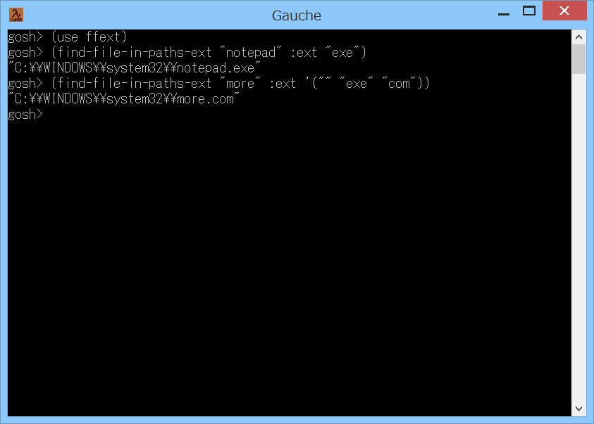

# ffext



## 概要
- Gauche で find-file-in-paths 手続きを拡張した find-file-in-paths-ext 手続きを  
  使用可能にするためのモジュールです。

- find-file-in-paths-ext 手続きは、ファイルの拡張子を指定して検索が行えます。


## インストール方法
- ffext.scm を Gauche でロード可能なフォルダにコピーします。  
  (例えば (gauche-site-library-directory) で表示されるフォルダ等)


## 使い方
```
  (use ffext) ; モジュールをロードします。
  
  (find-file-in-paths-ext "notepad" :ext "exe")
      ; ファイル notepad.exe を、環境変数 PATH の場所から探します
  
  (find-file-in-paths-ext "more" :ext '("" "exe" "com"))
      ; ファイル more か more.exe か more.com を、環境変数 PATH の場所から探します。
```
- find-file-in-paths-ext 手続きの書式は以下の通りです。  
  `find-file-in-paths-ext  name  :paths  paths  :pred  pred  :ext  ext`
  - 第1引数の name には、検索するファイル名を指定します。
    
  - キーワード引数の paths には、検索するパスのリストを指定します。  
    このキーワード引数を指定しなかった場合には、  
    環境変数PATHの示す場所が検索されます。
    
  - キーワード引数の pred には、検索したファイルが満たすべき述語の手続きを指定します。  
    このキーワード引数を指定しなかった場合には、  
    file-is-executable? が使用されます。
    
  - キーワード引数の ext には、検索するファイルの拡張子を指定します。  
    拡張子は文字列で指定します。また、複数の拡張子を指定する場合には、  
    文字列のリストで指定します。  
    このキーワード引数を指定しないか、または、空文字列を指定した場合には、  
    拡張子なしのファイルを検索します。
    
  - この手続きの戻り値は以下となります。  
    ファイルが見つかり、かつ、述語の手続きを満たした場合には、ファイルのフルパスが  
    返ります。  
    ファイルが見つからないか、または、述語の手続きを満たさなかった場合には、  
    `#f` が返ります。  
    複数のファイルが条件を満たすような場合には、最初に見つかったファイルのフルパスが  
    返ります。


## その他 情報等
1. 内部で、file.util の find-file-in-paths を使用しています。


## 環境等
- OS
  - Windows 8.1 (64bit)
- 言語
  - Gauche v0.9.4
  - Gauche v0.9.5_pre1

## 履歴
- 2016-7-24 v1.00 (初版)


(2016-7-24)
